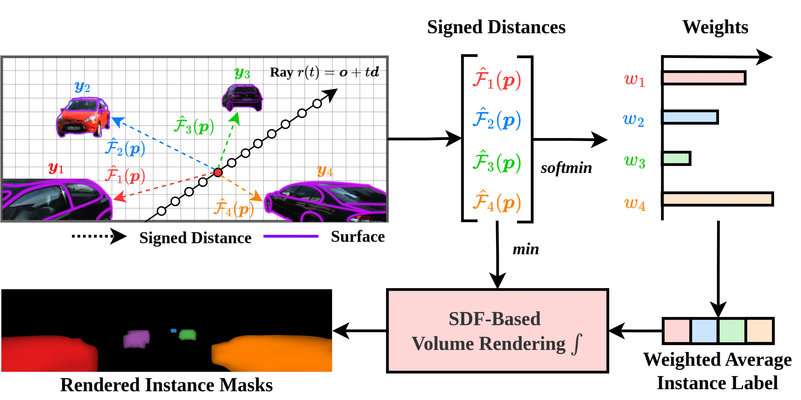
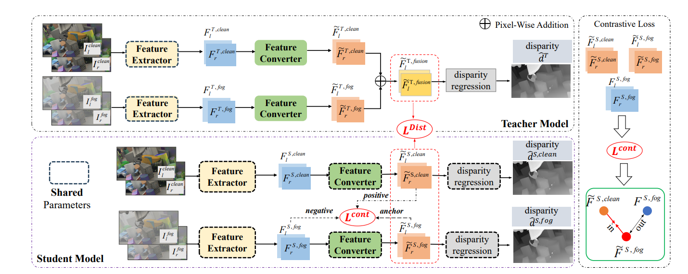
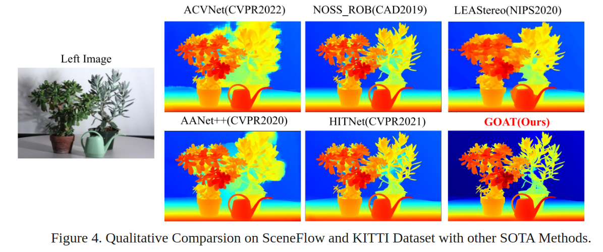
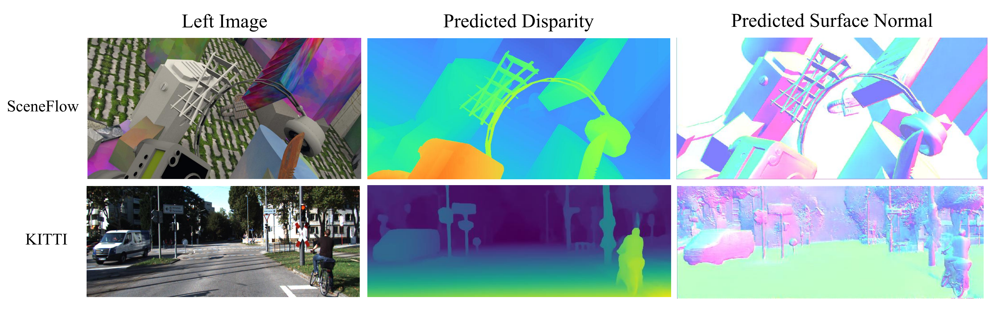
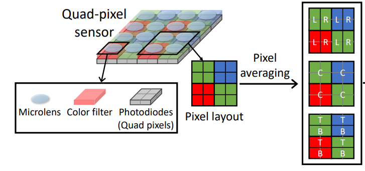
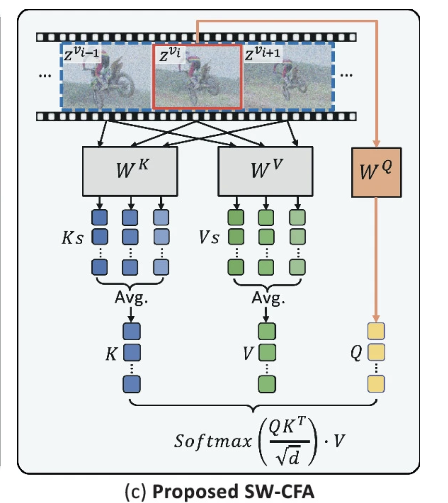

  <h3 style="margin: 0; color: #667eea;">📧 zliu@ok.sc.e.titech.ac.jp</h3>
  

    <strong>Ph.D Candidate</strong> 
    Room 307, South Building 5 
    Dept. of System Control and Engineering 
    Tokyo Institute of Technology, Tokyo, Japan
  

🎓 Biography
======
I am a final year Ph.D. student in [Okutomi Lab](http://www.ok.sc.e.titech.ac.jp/), Dept. of System Control and Engineering, Institute of Science Tokyo, advised by [Prof.Masatoshi Okutomi](http://www.ok.sc.e.titech.ac.jp/mem/mxo/okutomi.html). Before that, I obtained my M.S. degree from the same school and my B.S. degree from South China University of Technology in July 2020.   
My research interests lie in 3D vision and autonomous driving perception. Previously, I did some research on [Stereo Matching](http://www.ok.sc.e.titech.ac.jp/res/DeepSM/main.html) and 3D detections, now I am focused on generative models. Besides, I am also a reviewer for top conferences including NeurIPS, ICLR, ICML,CVPR, etc.

💼 Experience
======
*  **Woven by Toyota, Machine Learning Engineering Intern**.  &emsp;&emsp;&emsp;&emsp; 2025/08/01~  
Tokyo, Japan
Mentor: [Suxing Lyu](https://www.linkedin.com/in/suxing-lyu/?originalSubdomain=jp)

*  **Sony, R&D Intern**.  &emsp;&emsp;&emsp;&emsp; 2025/01/15- 2025/03/31          
   Tokyo, Japan  
   Supervisor: [Guifen Tian](https://scholar.google.co.jp/citations?hl=ja&user=tBAN-dgAAAAJ&view_op=list_works&sortby=pubdate)  

*  **Preferred Networks, R&D Intern**.  &emsp;&emsp;&emsp;&emsp; 2024/08/05-2024/09/30          
   Tokyo, Japan  
   Supervisor: [Taizan Yonetsuji](https://ieeexplore.ieee.org/author/38320112600)  

*  **Sensetime Japan, Researcher Intern**.  &emsp;&emsp;&emsp;&emsp; 2023/06/05-2023/11/30          
   Tokyo, Japan  
   Supervisor: [Hiroki Sakuma](https://www.linkedin.com/in/hiroki-sakuma-9a20a4255/?originalSubdomain=jp)  

*  **MEGVII, Computer Vision Engineering Intern**.  &emsp;&emsp;&emsp;&emsp; 2022/01/05-2022/03/30  
   Shanghai, China  
   Supervisor: [Zhao Yang]() 

*  **Tokyo Institute of Technology, Research Assistant**.  &emsp;&emsp;&emsp;&emsp; 2024/04/01- Now  
   Tokyo, Japan  
   Supervisor: [Masatoshi Okutomi](http://www.ok.sc.e.titech.ac.jp/mem/mxo/okutomi-j.html) 

🔔 News
======
* [07/2025] Our Paper "DMS:Diffusion-Based Multi-Baseline Stereo Generation for Improving Self-Supervised Depth Estimation." has been accepted by ICCV2025 AIM Workshop for oral presentation.
* [01/2025] Our paper titled "TDM: Temporally-Consistent Diffusion Model for All-in-One Real-World Video Restoration" has been selected as the Best Student Paper for MMM2025.
* [10/2024] One paper was accepted by MMM 2025.
* [07/2024] One paper was accepted by BMVC 2024.
* [02/2024] One paper was accepted by CVPR 2024.
* [02/2024] One paper was accepted by ICRA 2024.
* [10/2023] One paper was accepted by WACV 2024. 
* [06/2023] Start Intership at SenseTime Japan.
* [04/2023] Receive Tokyo Tech Advanced Human Resource Development Fellowship.
* [03/2023] Receive the SCIE Student Award. 
* [03/2023] Receive Excellent Grauduation Paper Award Award.
* [06/2022] One paper aws accepted by ACMMM 2022.

📝  Publications 
======

    

        
    

    

        <h3>CVPR 2024 VSRD: Volumetric Silhouette Rendering for Weakly Supervised 3D Object Detection. </h3>
        
<b>Zihua Liu*</b>, Hiriki Sakuma, Masatoshi Okutomi   Proceedings of the IEEE/CVF Computer Vision and Pattern Recognition.   <a href="https://arxiv.org/abs/2404.00149">📄 Paper</a>  &nbsp; &nbsp;   <a href="http://www.ok.sc.e.titech.ac.jp/res/VSRD/">🌐 Project</a> &nbsp; &nbsp; <a href="https://github.com/skmhrk1209/VSRD">💻 Code</a>
        

    

---

    

        
    

    

        <h3>ICRA 2024 CFDNet: A Generalizable Foggy Stereo Matching Network with Contrastive Feature Distillation. </h3>
        
<b>Zihua Liu</b>, Yizhou Li, Masatoshi Okutomi   IEEE International Conference on Robotics and Automation   <a href="https://arxiv.org/abs/2402.18181">📄 Paper</a>  &nbsp; &nbsp;   <a href="http://www.ok.sc.e.titech.ac.jp/res/FStereo/icra2024.html">🌐 Project</a> &nbsp; &nbsp; <a href="http://www.ok.sc.e.titech.ac.jp/res/FStereo/icra2024.html">💻 Code</a>
        

    

---

    

        
    

    

        <h3>WACV 2024 Global Occlusion-Aware Transformer for Robust Stereo Matching. </h3>
        
<b>Zihua Liu</b>, Yizhou Li, Masatoshi Okutomi    Proceedings of the IEEE/CVF Winter Conference on Applications of Computer Vision   <a href="https://arxiv.org/abs/2402.18181">📄 Paper</a>  &nbsp; &nbsp;   <a href="https://openaccess.thecvf.com/content/WACV2024/html">🌐 Project</a> &nbsp; &nbsp; <a href="https://github.com/Magicboomliu/GOAT">💻 Code</a>
        

    

---

    

        
    

    

        <h3>ACM MM 2022 Digging Into Normal Incorporated Stereo Matching.  </h3>
        
<b>Zihua Liu</b>, Songyan Zhang, Zhicheng Wang, Masatoshi Okutomi  Proceedings of the 30th ACM International Conference on Multimedia   <a href="https://dl.acm.org/doi/abs/10.1145/3503161.3548312">📄 Paper</a>  &nbsp; &nbsp;   <a href="http://www.ok.sc.e.titech.ac.jp/res/DeepSM/acmmm22.html">🌐 Project</a> &nbsp; &nbsp; <a href="https://github.com/Magicboomliu/NINet">💻 Code</a>
        

    

---

    

        
    

    

        <h3>BMVC 2024 Disparity Estimation Using a Quad-pixel Sensor. </h3>
        
Zhuofeng Wu, D.Lee, <b>Zihua Liu</b>, K.Yoshizaki, Masatoshi Okutomi   The Thirty Fifth British Machine Vision Conference   <a href="https://arxiv.org/abs/2409.00665">📄 Paper</a>  &nbsp; &nbsp;   <a href="http://www.ok.sc.e.titech.ac.jp/res/QP/index.html">🌐 Project</a> &nbsp; &nbsp; <a href="https://github.com/Zhuofeng-Wu/QPDNet">💻 Code</a>  &nbsp; &nbsp; <a href="https://www.dropbox.com/scl/fi/0sijedbg2kdqetmw16s9t/QP-Data-Zhuofeng-Wu.zip?rlkey=m33xsb70b4ivk0riyvg4fgk2u&e=1&st=k2fn4zkq&dl=0">📦 Dataset</a>
        

    

    

        
    

    

        <h3>MMM 2025 🏆 Best Student Paper TDM: Temporally-Consistent Diffusion Model for All-in-One Real-World Video Restoration </h3>
        
Yizhou Li, <b>Zihua Liu</b>, Yusuke Monno, Masatoshi Okutomi   MultiMedia Modeling: 31st International Conference on Multimedia Modeling   <a href="https://link.springer.com/chapter/10.1007/978-981-96-2071-5_12">📄 Paper</a>  &nbsp; &nbsp;   <a href="http://www.ok.sc.e.titech.ac.jp/res/TDM/index.html">🌐 Project</a> &nbsp; &nbsp; <a href="https://github.com/Yizhou-Li-CV/TDM">💻 Code</a>  
        

    

---

🏅 Honors & Awards 
======
*  Tokyo Tech Advanced Human Resource Development Fellowship. &emsp;&emsp;&emsp;&emsp; 2023/04-2026/04  
*  SCIE Student Award. &emsp;&emsp;&emsp;&emsp; 2023/03 

🤝  Services
======

* Reviewer for the CVPR2025, ICML2025 and ICLR2025  &emsp;&emsp;&emsp;&emsp; 2025                  

* Reviewer for the ACM International Conference on Multimedia  &emsp;&emsp;&emsp;&emsp; 2022,2024                  

* Reviewer for the BMVC  &emsp;&emsp;&emsp;&emsp;2024   

* Reviewer for the NeurIPS &emsp;&emsp;&emsp;&emsp;2024   

* Reviewer for the ICLR &emsp;&emsp;&emsp;&emsp;2024   

